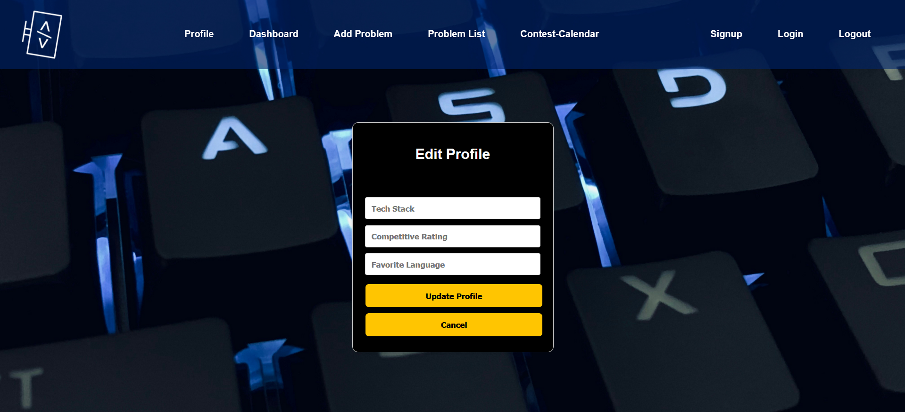
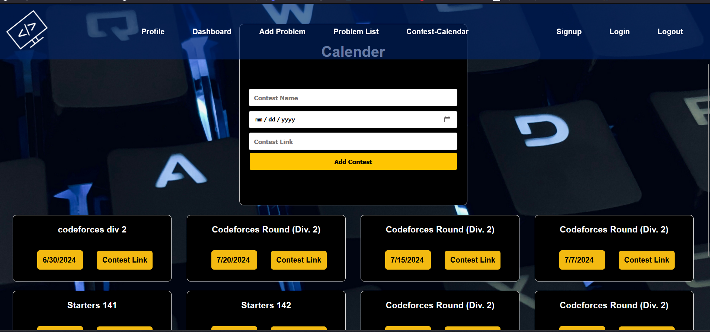

# Project_ZCoder

## Description
ZCoder is a sophisticated web platform designed to help users track their competitive programming journey by creating and managing contest calendars for various coding websites. This project utilizes Node.js, WebSocket, MongoDB, and React.js to provide a seamless and interactive experience for users.

## Features
 - **Contest Calenders:** Create and manage personalized calendars for coding contests across multiple platforms.
 - **Real Time Updates:** Integrated WebSocket for real-time notifications and updates on contest schedules.
 - **User Profiles:** Maintain personalized profiles to track progress, participation history, and favorite contests.
 - **Search and Filters:** Advanced search and filter options to find contests by platform, date, difficulty, and more.
 - **Responsive Design:** Responsive and user-friendly interface built with React.js, ensuring accessibility across various devices.

    

## Technologies Used

- **Frontend:** React.js, Axios
- **Backend:** Node.js, Express   
- **Database:** MongoDB, Mongoose
- **Real-time Communication:** WebSocket

## Installation and Setup

1. **Prerequisites:**
   - Node.js and npm installed.
   - MongoDB set up either locally or in the cloud.

2. **Clone the Repository:**
   ```sh
   git clone https://github.com/deepakkumartripathi119/Zcoder.git
   cd zcoder
   ```

3. **Backend Setup:**
   - Navigate to the backend directory.
   - Install dependencies:
     ```sh
     cd backend
     npm install
     ```
   - Start the server:
     ```sh
     node index.js
     

4. **Frontend Setup:**
   - Navigate to the frontend directory.
   - Install dependencies:
     ```sh
     cd frontend
     npm install
     ```
   - Start the React app:
     ```sh
     npm run dev
     ```
   - The application should now be running on `http://localhost:3000`.


## Web Application Snippets


1. Home Page<br>

<br>

2. Sign Up<br>

<br>

3. LogIn<br>

<br>

4. profile<br>

<br>

5. Edit Profile<br>

<br>

6. Add Problem<br>

<br>

7. Problem List<br>

<br>

8. Dashboard<br>

<br>

9. Contest Calander<br>

<br>


## Contributing
We welcome contributions from the community. If you wish to contribute to ZCoder, please follow these steps:
 - Fork the repository.
 - Create a new branch (git checkout -b feature/your-feature).
 - Make your changes.
 - Commit your changes (git commit -am 'Add some feature').
 - Push to the branch (git push origin feature/your-feature).
 - Open a Pull Request for review.
 
## Acknowledgements
We would like to extend our gratitude to the developers and contributors of the libraries and frameworks utilized in this project
